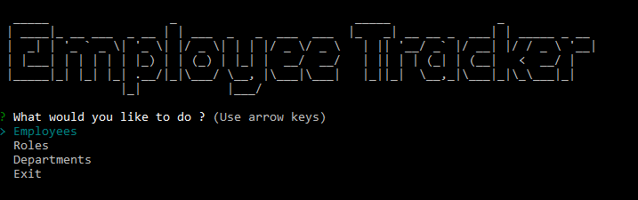

# Employee Tracker System

[](https://opensource.org/licenses/MIT)


## Description  
A Node JS application helps to build basic employee information stored in mysql database.




## Table of Contents

- [Installation](#Installation)<br>
- [Usage](#Usage)<br>
- [License](#License)<br>
- [Questions](#Questions)


## Installation 
- clone the project
- Open terminal
- change directory to the project directory
- run below: <br>
```
npm i
```

## Usage 
- Open
- change directory to the project directory
- run below: <br>
```
npm start
```

## License

[MIT](https://opensource.org/licenses/MIT)

## Questions
Github: [@riheelh](https:/www.github.com/riheelh) <br>